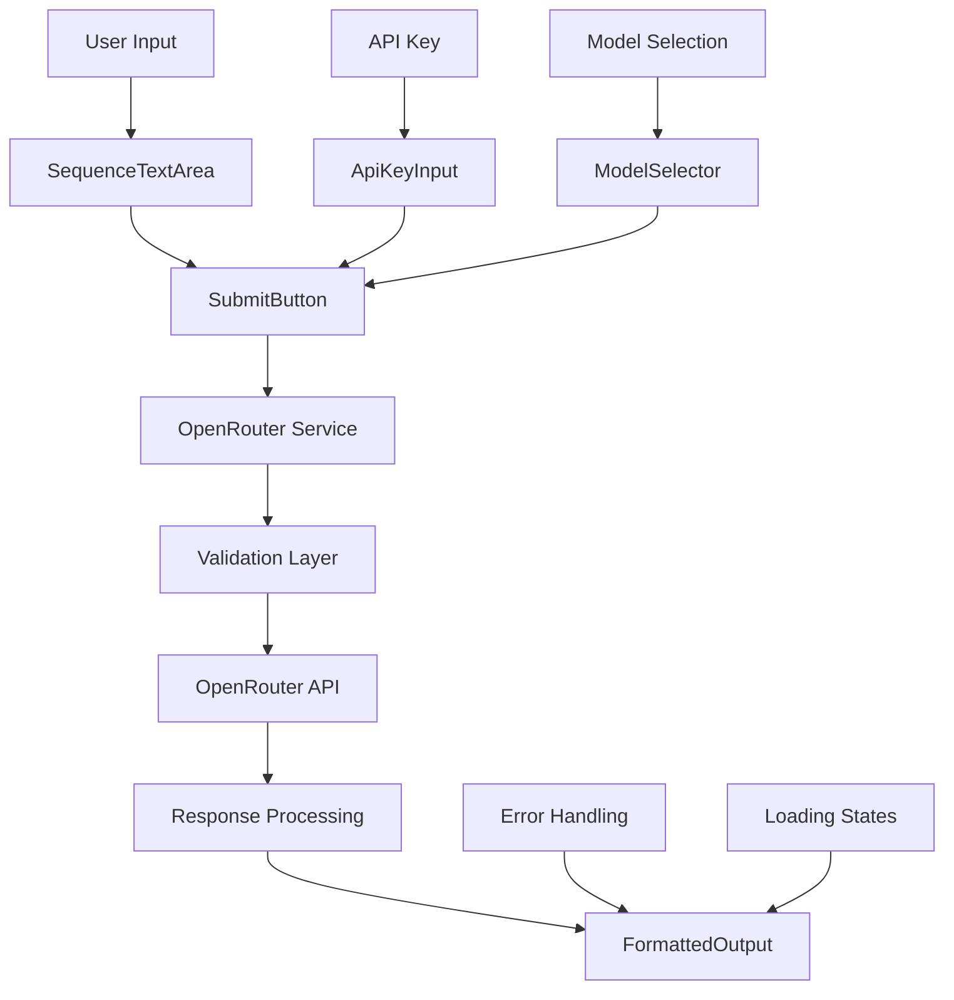
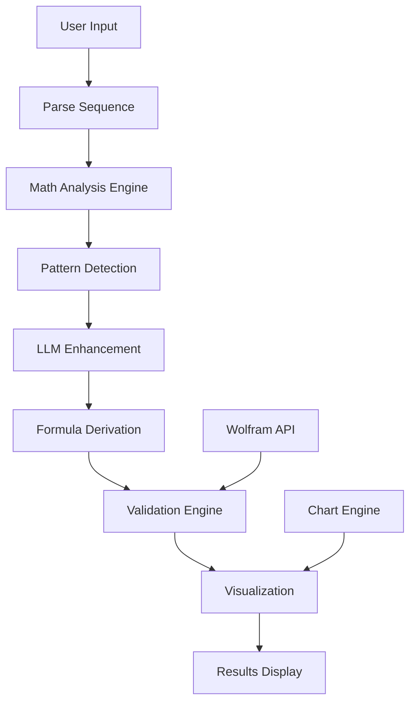

# Number Sequence Analyzer - Technical Design Document

## Overview

A specialized web application for **game designers** to analyze numerical sequences and progression systems using LLM integration. Designed to help identify patterns in game mechanics like XP curves, damage scaling, economy balancing, and progression formulas.

### Target Users: Game Designers
- **Level designers** analyzing XP progression curves
- **Game economists** balancing in-game currencies and costs
- **System designers** creating damage/health scaling formulas
- **Monetization specialists** optimizing IAP pricing tiers
- **Indie developers** reverse-engineering successful game mechanics

### Common Game Design Use Cases
- **XP/Level Progression**: "100, 200, 400, 800, 1600..." → Exponential leveling
- **Damage Scaling**: "10, 12, 15, 19, 24..." → Quadratic damage growth
- **Currency Costs**: "50, 75, 112, 168, 252..." → Building upgrade costs
- **Drop Rates**: "10%, 7.5%, 5.6%, 4.2%..." → Diminishing probability
- **Time Gates**: "5min, 10min, 20min, 40min..." → Exponential wait times
- **🔬 Piecewise Progressions**: "10, 20, 30, 50, 80, 160, 320..." → Linear→Quadratic→Exponential

### Current Implementation Status

#### ✅ MVP Features (Completed)
- ✅ React app with Vite build system
- ✅ API key input with validation
- ✅ Model selection dropdown (3 models)
- ✅ Game-focused sequence text area
- ✅ OpenRouter API integration
- ✅ Comprehensive error handling
- ✅ Loading states and user feedback
- ✅ Game design-focused LLM prompts
- ✅ Responsive UI with game-themed styling
- ✅ GitHub Pages deployment ready

#### 🟡 Next Iterations (Planned)
- Mathematical analysis engine (differences, growth rates)
- Formula derivation and accuracy calculations
- Chart visualizations
- Wolfram Alpha integration
- Piecewise function detection

## Technology Stack

### Frontend (Client-Side Only)
- **Framework**: React 19.1.1 with JavaScript
- **Styling**: Custom CSS with game-themed design
- **Build Tool**: Vite 7.1.2 for development and GitHub Pages deployment
- **API Client**: Native fetch() API with comprehensive error handling
- **Hosting**: GitHub Pages (static files)
- **State Management**: React useState (sufficient for current scope)

### External APIs
- **LLM Provider**: OpenRouter API
- **Models**: 3 options implemented:
  - `openai/gpt-3.5-turbo`
  - `anthropic/claude-3-haiku`
  - `meta-llama/llama-3.1-8b-instruct`

### Dependencies & Setup

#### Current Dependencies
```json
{
  "dependencies": {
    "react": "^19.1.1",
    "react-dom": "^19.1.1"
  },
  "devDependencies": {
    "vite": "^7.1.2",
    "gh-pages": "^6.3.0",
    "eslint": "^9.33.0"
  }
}
```

#### Future Dependencies (Epic 2+)
- **mathjs** or custom evaluator for safe formula evaluation
- **Chart.js 4.x** or **Recharts 2.x** for visualizations
- **Wolfram API** integration (optional, Epic 4)

#### Security Considerations
- ✅ No eval() usage - safe formula evaluation required for future epics
- ✅ Input sanitization implemented
- ✅ API key validation and secure handling
- ✅ Error boundary patterns for robust error handling

## Application Architecture

### Current MVP Architecture


### Future Architecture (Epic 2+)


## Component Structure

### MVP Components ✅ Implemented

```
App
├── Header (title)
├── ConfigSection
│   ├── ApiKeyInput ✅
│   └── ModelSelector ✅
├── InputSection
│   ├── SequenceTextArea ✅
│   └── SubmitButton ✅
└── ResultsSection
    └── FormattedOutput ✅
```

### Component Details

#### ApiKeyInput ✅ Implemented
- Password-type input for OpenRouter API key security
- Component state only (not persisted for security)
- ✅ Advanced validation: format checking (sk-or- or sk- prefix)
- ✅ Real-time validation feedback
- ✅ Error states with user-friendly messages

#### ModelSelector ✅ Implemented
- Dropdown with 3 model options:
  - `openai/gpt-3.5-turbo` (fast, cost-effective)
  - `anthropic/claude-3-haiku` (balanced performance)
  - `meta-llama/llama-3.1-8b-instruct` (open source)
- ✅ Model validation in service layer
- ✅ Default selection (GPT-3.5-turbo)

#### SequenceTextArea ✅ Implemented
- Large text area optimized for game mechanic data
- ✅ Game-focused placeholder with examples
- ✅ Flexible input handling - supports various formats and units
- ✅ No restrictive validation - LLM handles diverse data formats

#### SubmitButton ✅ Implemented
- ✅ Smart disabled state (requires API key)
- ✅ Loading state with spinner animation
- ✅ Game-themed text: "🎮 Analyze Game Progression"
- ✅ Loading text: "🔍 Analyzing progression balance..."
- ✅ Accessibility features (ARIA labels)

#### FormattedOutput ✅ Implemented
- ✅ Markdown rendering for structured LLM responses
- ✅ Game design-focused response formatting
- ✅ Pattern highlighting and balance recommendations
- ✅ Error state handling with user-friendly messages
- ✅ Responsive design for mobile/desktop

## OpenRouter Integration ✅ Implemented

### Enhanced API Service Architecture

#### Game Design-Focused System Prompt ✅ Implemented
```javascript
getSystemPrompt() {
  return `You are a specialized game design consultant and mathematician focusing on numerical progression systems in games.

Your expertise includes:
- XP/Level progression curves (linear, quadratic, exponential)
- Damage scaling systems and balance
- Economy progression (building costs, upgrade prices)
- Time gate mechanics (wait times, cooldowns)
- Drop rate progressions and probability curves
- IAP pricing tier optimization
- Piecewise progression systems

When analyzing sequences:
1. Format data into clean markdown table
2. Identify mathematical pattern
3. Provide game design insights:
   - Game mechanic type identification
   - Player experience assessment
   - Balance recommendations
   - Similar games examples
   - Monetization implications`
}
```

#### Comprehensive Error Handling ✅ Implemented
- ✅ **401 Unauthorized**: "Invalid API key. Please check your OpenRouter API key."
- ✅ **429 Rate Limit**: "Rate limit exceeded. Please wait a moment and try again."
- ✅ **500 Server Error**: "OpenRouter service error. Please try again later."
- ✅ **Network Issues**: "Network error. Please check your internet connection."
- ✅ **Invalid Response**: Structured error handling for malformed responses
- ✅ **Model Validation**: Pre-request validation prevents API errors

#### Security Features ✅ Implemented
```javascript
// API key validation
validateApiKey(apiKey) {
  const trimmed = apiKey.trim()
  return trimmed.length > 10 && (trimmed.startsWith('sk-or-') || trimmed.startsWith('sk-'))
}

// Model validation
isSupportedModel(model) {
  const supportedModels = [
    'openai/gpt-3.5-turbo',
    'anthropic/claude-3-haiku', 
    'meta-llama/llama-3.1-8b-instruct'
  ]
  return supportedModels.includes(model)
}
```

## Development Roadmap

### Epic 2: Mathematical Analysis Engine
**Duration: 3-4 hours** | **Status: 🟡 Ready for Implementation**

#### Enhanced Mathematical Utilities

```javascript
// Complete mathematical analysis toolkit
const MathUtils = {
  // Multi-order differences calculator
  differences: (sequence, order = 1) => {
    let result = [...sequence]
    for (let i = 0; i < order; i++) {
      result = result.slice(1).map((val, idx) => val - result[idx])
    }
    return result
  },

  // Variance calculation for pattern shift detection
  calculateVariance: (arr) => {
    const mean = arr.reduce((a, b) => a + b, 0) / arr.length
    return arr.reduce((sum, val) => sum + Math.pow(val - mean, 2), 0) / arr.length
  },

  // Enhanced pattern detection
  detectProgressionType: (sequence) => {
    const first = MathUtils.differences(sequence, 1)
    const second = MathUtils.differences(sequence, 2)
    const ratios = sequence.slice(1).map((v, i) => v / sequence[i])
    
    // Linear: constant first differences
    if (Math.max(...first) - Math.min(...first) < 0.01) {
      return { 
        type: 'linear', 
        formula: `${first[0]} * n + ${sequence[0] - first[0]}`,
        confidence: 0.95
      }
    }
    
    // Quadratic: constant second differences
    if (Math.max(...second) - Math.min(...second) < 0.01) {
      return { 
        type: 'quadratic', 
        formula: 'an² + bn + c',
        confidence: 0.90
      }
    }
    
    // Exponential: constant ratios
    if (Math.max(...ratios) - Math.min(...ratios) < 0.01) {
      return { 
        type: 'exponential', 
        formula: `${sequence[0]} * ${ratios[0]}^(n-1)`,
        confidence: 0.88
      }
    }
    
    return { type: 'custom', formula: 'complex pattern', confidence: 0.5 }
  }
}
```

### Epic 3: Validation & Accuracy Engine
**Duration: 2-3 hours** | **Status: ⏳ Depends on Epic 2**

#### Safe Formula Evaluation System

```javascript
// Secure formula evaluator (replaces dangerous eval())
class FormulaEvaluator {
  constructor(formula) {
    this.formula = formula
    this.compiled = this.compile(formula)
  }
  
  compile(formula) {
    // Support only safe mathematical operations
    const safe = formula
      .replace(/\bn\b/g, '(n)')
      .replace(/\^/g, '**')
      .replace(/log/g, 'Math.log')
      .replace(/sqrt/g, 'Math.sqrt')
    
    // Security validation - block dangerous patterns
    if (/[;{}=]|function|eval|window|document/i.test(safe)) {
      throw new Error('Unsafe formula detected')
    }
    
    return new Function('n', `return ${safe}`)
  }
  
  evaluate(n) {
    try {
      const result = this.compiled(n)
      return isFinite(result) ? result : NaN
    } catch (e) {
      return NaN
    }
  }
}
```

### Epic 4: Wolfram Alpha Integration
**Duration: 2 hours** | **Status: ⏳ Optional Enhancement**

#### Enhanced Wolfram Alpha Strategy

```javascript
// Wolfram Alpha configuration with fallback strategy
const wolframConfig = {
  endpoint: 'https://api.wolframalpha.com/v1/result',
  limits: {
    free: 2000,        // requests per month
    student: 3000,     // requests per month
    pro: 'unlimited'   // paid tier
  },
  
  // Fallback to local analysis when Wolfram unavailable
  fallback: async (sequence) => {
    console.warn('Wolfram API unavailable, using local mathematical analysis')
    return MathUtils.detectProgressionType(sequence)
  }
}
```

## Error States & Performance Constraints

### Error State Management
```javascript
const ERROR_STATES = {
  INVALID_SEQUENCE: 'Minimum 3 numbers required for analysis',
  FORMULA_PARSE_ERROR: 'Could not derive mathematical formula',
  WOLFRAM_LIMIT: 'API limit reached, using local analysis', 
  PIECEWISE_TOO_COMPLEX: 'Pattern too complex for automatic detection',
  NETWORK_ERROR: 'Network error. Please check your connection.',
  API_KEY_INVALID: 'Invalid API key format',
  RATE_LIMIT_EXCEEDED: 'Rate limit exceeded. Please wait and try again.',
  EVALUATION_ERROR: 'Formula evaluation failed - check formula syntax'
}
```

### Performance Limits
- **Max sequence length**: 1000 elements (UI warning at 500+)
- **Max piecewise segments**: 10 (complexity warning at 5+)
- **Chart render limit**: 500 points (pagination for larger datasets)
- **LLM timeout**: 30 seconds
- **Formula evaluation**: 10,000 calculations max per analysis

## Implementation Priority & Technical Roadmap

### Current Status Matrix
| Epic | Status | Implementation | Confidence | Dependencies |
|------|--------|----------------|------------|-------------|
| **Epic 1 (MVP)** | ✅ Complete | 100% | High | ✅ None |
| **Epic 2 (Math Engine)** | 🟡 Ready | 0% | High | Formula evaluator |
| **Epic 3 (Validation)** | ⏳ Blocked | 0% | Medium | Epic 2 |
| **Epic 4 (Wolfram)** | ⏳ Optional | 0% | Low | API key, fallback |
| **Epic 5 (Visualization)** | ⏳ Waiting | 0% | Medium | Chart.js/Recharts |
| **Epic 6 (Advanced)** | ⏳ Future | 0% | Low | Complex algorithms |

### Next Sprint Priorities

#### Sprint 1: Mathematical Foundation (Epic 2)
**Goal**: Add local mathematical analysis to complement LLM

1. **Implement MathUtils class** (4 hours)
   - Differences calculator
   - Pattern detection algorithms
   - Variance calculations

2. **Integrate with existing LLM flow** (2 hours)
   - Enhance prompts with mathematical context
   - Add fallback when LLM fails

3. **Add mathematical context to UI** (2 hours)
   - Show differences in results
   - Display pattern confidence scores

## Testing Strategy

### Current MVP Testing ✅ Completed
- [x] App loads without errors
- [x] API key input validation works
- [x] Model selection changes properly
- [x] Submit button enables/disables correctly
- [x] API call succeeds with valid key
- [x] Error shown with invalid key
- [x] Response displays correctly in markdown
- [x] Mobile responsive design works
- [x] Game-themed UI elements display
- [x] Loading states function properly

### Game Design Test Cases ✅ Expanded
- **XP Progression**: "100, 300, 600, 1000, 1500, 2100" (quadratic)
- **Exponential Costs**: "10, 20, 40, 80, 160" (exponential growth)
- **Damage Scaling**: "12, 15, 19, 24, 30, 37" (polynomial growth)
- **Drop Rate Decay**: "10%, 7.5%, 5.6%, 4.2%" (percentage sequences)
- **Mixed Units**: "5 min, 10 min, 20 min, 40 min" (time progressions)
- **🔬 Piecewise Progression**: "10, 20, 30, 40, 50, 75, 112, 225, 450"
- **Messy Game Data**: "100 XP   300XP,600 xp;1000" (real-world copy-paste)
- **Currency Format**: "$0.99, $1.99, $4.99, $9.99" (IAP pricing tiers)
- **Empty Input**: "" (graceful handling) ✅
- **Invalid Data**: "abc, def, ghi" (non-numeric handling) ✅

## GitHub Pages Deployment ✅ Implemented

### Current Build Configuration ✅
```json
{
  "name": "number-sequence-analyzer",
  "homepage": "https://uz0r.github.io/QoderRepos/",
  "scripts": {
    "build": "vite build",
    "preview": "vite preview",
    "predeploy": "npm run build",
    "deploy": "gh-pages -d dist"
  }
}
```

### Deployment Status ✅
- ✅ **GitHub Pages**: Configured and ready
- ✅ **gh-pages dependency**: Installed and configured
- ✅ **Build optimization**: Vendor chunks, no sourcemaps
- ✅ **Base path**: Correctly configured for repository
- ✅ **Auto-deployment**: `npm run deploy` ready