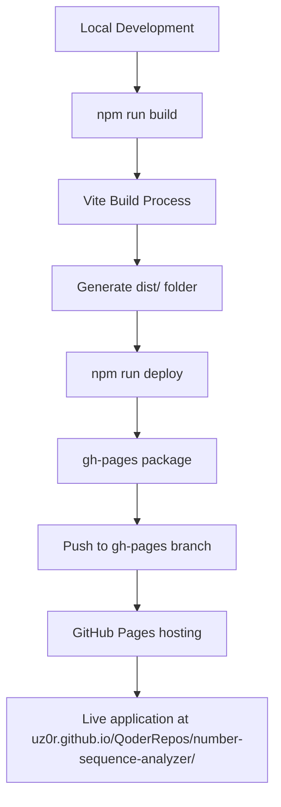
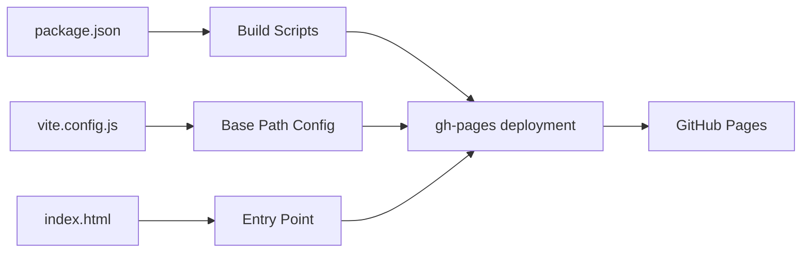
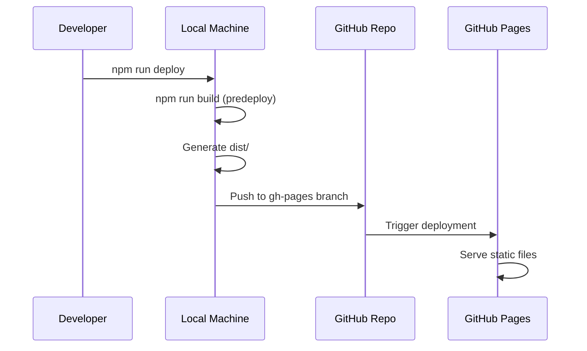

# GitHub Pages Deployment Setup Design

## Overview

This design outlines the configuration and implementation steps required to deploy the Number Sequence Analyzer React + Vite application to GitHub Pages using the gh-pages package approach. The project is a single-page application (SPA) that analyzes number sequences using LLM APIs and requires proper configuration for static hosting.

## Current Project Status

### Project Location
The project is currently hosted as part of a larger repository structure:
- **Repository**: `QoderRepos` (under uz0r GitHub account)
- **Project Path**: `/number-sequence-analyzer/` within the repository
- **Live URL**: https://uz0r.github.io/QoderRepos/number-sequence-analyzer/
- **Base Path Configuration**: Must account for the nested repository structure

### Existing Configuration
- **Framework**: React 19.1.1 with Vite 7.1.2
- **Repository Name**: `number-sequence-analyzer`
- **Current Live URL**: https://uz0r.github.io/QoderRepos/number-sequence-analyzer/
- **Base Path**: Already configured as `/number-sequence-analyzer/` in `vite.config.js`
- **Build Output**: `dist` folder
- **Dependencies**: gh-pages package already installed (v6.3.0)

### Deployment Requirements
- Static hosting on GitHub Pages
- Support for SPA routing (if routing is added later)
- Proper asset path resolution
- API key security (client-side only)

## Architecture

### Deployment Flow



### Configuration Architecture



## Configuration Components

### Vite Configuration

#### Current Setup Analysis
The `vite.config.js` is properly configured with:
- Base path: `/number-sequence-analyzer/`
- Build output: `dist` directory
- Assets directory: `assets`

#### Required Base Path Configuration
Since the project is hosted within a larger repository (`QoderRepos`), the base path must reflect the full path structure:

```javascript
export default defineConfig({
  plugins: [react()],
  base: '/QoderRepos/number-sequence-analyzer/', // Full path including parent repo
  build: {
    outDir: 'dist',
    assetsDir: 'assets',
    sourcemap: false, // For production
    minify: 'terser'
  }
})
```

**Important**: The current `vite.config.js` has base path as `/number-sequence-analyzer/` which may need updating to `/QoderRepos/number-sequence-analyzer/` depending on the deployment structure.

### Package.json Modifications

#### Required Script Updates
Current `package.json` needs enhancement:

```json
{
  "name": "number-sequence-analyzer",
  "homepage": "https://uz0r.github.io/QoderRepos/number-sequence-analyzer/",
  "scripts": {
    "dev": "vite",
    "build": "vite build",
    "lint": "eslint .",
    "preview": "vite preview",
    "predeploy": "npm run build",
    "deploy": "gh-pages -d dist"
  }
}
```

#### Key Configuration Elements
- **homepage**: Full URL where the app will be hosted
- **predeploy**: Automatically builds before deployment
- **deploy**: Publishes dist folder to gh-pages branch

### GitHub Repository Settings

#### Pages Configuration
1. **Source**: gh-pages branch
2. **Root Directory**: / (root of gh-pages branch)
3. **Custom Domain**: Not required for this setup

#### Branch Structure
```
main branch (development)
├── src/
├── public/
├── dist/ (build output)
└── package.json

gh-pages branch (deployment)
├── index.html
├── assets/
└── Other built files
```

## Asset Management Strategy

### Static Asset Handling

#### Public Directory Structure
```
public/
├── vite.svg (favicon)
└── [future static assets]
```

#### Asset Reference Patterns
```javascript
// For static files in public/


// With base URL consideration


// Environment variable access
const basePath = import.meta.env.BASE_URL; // "/number-sequence-analyzer/"
const isProduction = import.meta.env.PROD; // true in production
```

### Build Optimization

#### Production Build Configuration
```javascript
// Enhanced vite.config.js for production
export default defineConfig({
  plugins: [react()],
  base: '/number-sequence-analyzer/',
  build: {
    outDir: 'dist',
    assetsDir: 'assets',
    sourcemap: false,
    minify: 'terser',
    rollupOptions: {
      output: {
        manualChunks: {
          'react-vendor': ['react', 'react-dom']
        }
      }
    }
  }
})
```

## Deployment Process

### Step-by-Step Implementation

#### 1. Configuration Updates
```bash
# Verify package.json has correct homepage
# Update scripts if needed
# Ensure gh-pages dependency is installed
```

#### 2. Build Verification
```bash
# Test local build
npm run build
npm run preview

# Verify assets load correctly at localhost:4173
```

#### 3. Deployment Execution
```bash
# Deploy to GitHub Pages
npm run deploy

# This will:
# 1. Run npm run build (via predeploy)
# 2. Create/update gh-pages branch
# 3. Push dist contents to gh-pages branch
```

#### 4. GitHub Settings Configuration
1. Navigate to repository Settings → Pages
2. Select "gh-pages" branch as source
3. Wait for deployment (usually 1-2 minutes)
4. Access at `https://uz0r.github.io/QoderRepos/number-sequence-analyzer/`

### Automated Deployment Workflow



## Security Considerations

### API Key Management
- **Client-side only**: No server-side storage
- **Runtime input**: User enters API key in UI
- **No persistence**: Keys stored only in component state
- **No exposure**: Keys not in build artifacts or version control

### Environment Variables
```javascript
// Safe environment access patterns
const isDevelopment = import.meta.env.DEV;
const basePath = import.meta.env.BASE_URL;

// NEVER expose sensitive data in VITE_ prefixed variables
// All VITE_ variables are publicly accessible in client
```

## Troubleshooting Guide

### Common Issues and Solutions

#### Blank Page (White Screen)
**Symptoms**: Page loads but shows blank screen
**Causes**: 
- Incorrect base path configuration
- Missing homepage in package.json
- Assets not loading

**Solutions**:
```javascript
// Verify vite.config.js base path matches repository structure exactly
base: '/QoderRepos/number-sequence-analyzer/', // Must include parent repo path

// Verify package.json homepage
"homepage": "https://uz0r.github.io/QoderRepos/number-sequence-analyzer/"
```

#### 404 Errors for Assets
**Symptoms**: CSS/JS files return 404
**Causes**: 
- Base path mismatch
- Incorrect asset references

**Solutions**:
- Ensure base path includes trailing slash
- Use import.meta.env.BASE_URL for dynamic paths
- Verify build output structure

#### Deployment Failures
**Symptoms**: `npm run deploy` fails
**Causes**:
- Missing gh-pages dependency
- Git authentication issues
- Build failures

**Solutions**:
```bash
# Reinstall gh-pages
npm install gh-pages --save-dev

# Verify git authentication
git remote -v

# Test build separately
npm run build
```

### Debug Commands
```bash
# Verify build output
npm run build
ls -la dist/

# Test locally
npm run preview

# Check deployment branch
git branch -a
git log --oneline gh-pages
```

## Testing Strategy

### Pre-deployment Testing

#### Local Build Verification
```bash
# Build and test locally
npm run build
npm run preview

# Verify at http://localhost:4173
# Check all features work
# Verify asset loading
```

#### Production Environment Simulation
```bash
# Serve from dist directory
npx serve dist -s

# Test with base path
npx serve dist -s -l 4000
# Navigate to localhost:4000/number-sequence-analyzer/
```

### Post-deployment Testing

#### Functionality Checklist
- [ ] Application loads without errors
- [ ] All components render correctly
- [ ] API key input functions properly
- [ ] Model selection works
- [ ] Sequence analysis processes correctly
- [ ] Results display properly
- [ ] No console errors
- [ ] Assets load from correct paths

#### Performance Verification
- [ ] Initial load time acceptable
- [ ] Assets cached properly
- [ ] No unnecessary network requests
- [ ] Bundle size reasonable

## Maintenance and Updates

### Regular Deployment Process
```bash
# Standard development workflow
git add .
git commit -m "Feature: Add new functionality"
git push origin main

# Deploy to GitHub Pages
npm run deploy
```

### Configuration Updates
When repository name changes or base path needs modification:

1. Update `vite.config.js` base path to match repository structure
2. Update `package.json` homepage URL
3. Test locally with `npm run preview`
4. Deploy with `npm run deploy`
5. Verify GitHub Pages settings

**Note**: For nested repository structures like `/QoderRepos/number-sequence-analyzer/`, ensure the base path includes the full path from the repository root.

### Dependency Updates
```bash
# Update gh-pages package
npm update gh-pages

# Update build dependencies
npm update vite @vitejs/plugin-react
```


