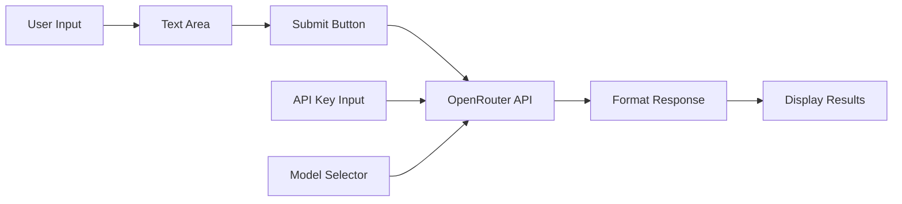
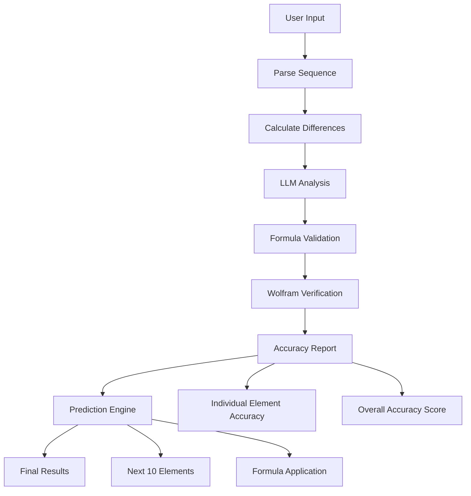

# Number Sequence Analyzer - MVP Design Document

## Overview

A specialized web application for **game designers** to analyze numerical sequences and progression systems using LLM integration. Designed to help identify patterns in game mechanics like XP curves, damage scaling, economy balancing, and progression formulas.

### Target Users: Game Designers
- **Level designers** analyzing XP progression curves
- **Game economists** balancing in-game currencies and costs
- **System designers** creating damage/health scaling formulas
- **Monetization specialists** optimizing IAP pricing tiers
- **Indie developers** reverse-engineering successful game mechanics

### Common Game Design Use Cases
- **XP/Level Progression**: "100, 200, 400, 800, 1600..." → Exponential leveling
- **Damage Scaling**: "10, 12, 15, 19, 24..." → Quadratic damage growth
- **Currency Costs**: "50, 75, 112, 168, 252..." → Building upgrade costs
- **Drop Rates**: "10%, 7.5%, 5.6%, 4.2%..." → Diminishing probability
- **Time Gates**: "5min, 10min, 20min, 40min..." → Exponential wait times
- **🔬 Piecewise Progressions**: "10, 20, 30, 50, 80, 160, 320..." → Linear→Quadratic→Exponential
  - Early game: Linear growth for easy onboarding
  - Mid game: Quadratic for steady progression
  - Late game: Exponential for long-term retention

### MVP Features (Iteration 1)
- User inputs number sequences in a text area
- API key input field in UI
- Model selection dropdown (2-3 options)
- OpenRouter API integration for LLM processing
- Format sequences into markdown tables
- Display LLM response directly below input

### Future Iterations
- Mathematical analysis (differences, growth rates)
- Formula derivation and accuracy calculations
- Chart visualizations
- Wolfram Alpha integration

## Technology Stack

### Frontend (Client-Side Only)
- **Framework**: React with JavaScript (simple setup)
- **Styling**: Basic CSS or Tailwind via CDN
- **Build Tool**: Vite for development and GitHub Pages deployment
- **API Client**: Native fetch() API
- **Hosting**: GitHub Pages (static files)

### External APIs
- **LLM Provider**: OpenRouter API
- **Models**: 2-3 options in dropdown (e.g., GPT-3.5, Claude, Llama)

## Application Architecture



## Component Structure

### MVP Components (Keep It Simple)

```
App
├── Header (title)
├── ConfigSection
│   ├── ApiKeyInput
│   └── ModelSelector
├── InputSection
│   ├── SequenceTextArea
│   └── SubmitButton
└── ResultsSection
    └── FormattedOutput
```

### Component Details

#### ApiKeyInput
- Simple text input for OpenRouter API key
- Store in component state (not persisted for security)
- Basic validation (non-empty)

#### ModelSelector
- Dropdown with 2-3 model options:
  - `openai/gpt-3.5-turbo`
  - `anthropic/claude-3-haiku`
  - `meta-llama/llama-3.1-8b-instruct`

**Note**: Model names must match OpenRouter API exactly

#### SequenceTextArea
- Large text area for game mechanic numbers
- **Game-focused placeholder**: 
  ```
  "Enter your game progression numbers:
  
  Examples:
  • XP Requirements: 100, 300, 600, 1000, 1500...
  • Damage Values: 10, 12, 15, 19, 24...
  • Building Costs: 50, 75, 112, 168, 252...
  • Wait Times: 5min, 10min, 20min, 40min..."
  ```
- No validation initially (let LLM handle various game data formats)
- Support for different units (gold, XP, minutes, %, etc.)

#### SubmitButton
- Disabled when API key is empty
- Shows loading state during API call
- **Game-themed text**: "🎮 Analyze Game Progression"
- Loading text: "🔍 Analyzing progression balance..."

#### FormattedOutput
- Display LLM response with game design insights
- Highlight game design patterns and balance recommendations
- Show similar games examples
- Include player experience assessment

## OpenRouter Integration

### API Request Format
```javascript
const response = await fetch('https://openrouter.ai/api/v1/chat/completions', {
  method: 'POST',
  headers: {
    'Authorization': `Bearer ${apiKey}`,
    'Content-Type': 'application/json'
  },
  body: JSON.stringify({
    model: selectedModel,
    messages: [
      {
        role: 'system',
        content: 'Format the given number sequence into a clean markdown table. Extract only the numbers and present them clearly.'
      },
      {
        role: 'user',
        content: userInput
      }
    ],
    temperature: 0.1
  })
});
```

### Error Handling
- Invalid API key → show error message
- Network issues → retry option
- Rate limiting → inform user to wait
- Invalid model → fallback to default

## Development Phases

### Phase 1: Basic Setup (30 minutes)
- Create React app with Vite
- Basic HTML structure
- API key input and model selector
- Submit button (no functionality yet)

### Phase 2: OpenRouter Integration (45 minutes)
- Implement API call function
- Connect submit button to API
- Display raw response
- Basic error handling

### Phase 3: UI Polish (30 minutes)
- Style with basic CSS
- Loading states
- Better error messages
- Responsive layout

### Phase 4: Testing & Deployment (15 minutes)
- Test with different inputs
- Build for production
- Deploy to GitHub Pages

## Testing Strategy

### Manual Testing Checklist
- [ ] App loads without errors
- [ ] API key input works
- [ ] Model selection changes
- [ ] Submit button enables/disables correctly
- [ ] API call succeeds with valid key
- [ ] Error shown with invalid key
- [ ] Response displays correctly
- [ ] Works on mobile devices

### Test Cases for Game Design
- **XP Progression**: "100, 300, 600, 1000, 1500, 2100" (quadratic)
- **Exponential Costs**: "10, 20, 40, 80, 160" (exponential growth)
- **Damage Scaling**: "12, 15, 19, 24, 30, 37" (polynomial growth)
- **Drop Rate Decay**: "10%, 7.5%, 5.6%, 4.2%" (percentage sequences)
- **Mixed Units**: "5 min, 10 min, 20 min, 40 min" (time progressions)
- **🔬 Piecewise Progression**: "10, 20, 30, 40, 50, 75, 112, 225, 450" 
  - Levels 1-5: Linear (+10 each)
  - Levels 6-8: Quadratic acceleration 
  - Level 9+: Exponential growth
- **Messy Game Data**: "100 XP   300XP,600 xp;1000" (real-world copy-paste)
- **Currency Format**: "$0.99, $1.99, $4.99, $9.99" (IAP pricing tiers)
- **Empty Input**: "" (graceful handling)

### Game Design UI/UX Enhancements

#### Visual Theme
- **Color Scheme**: Gaming-inspired (dark theme option)
- **Icons**: Game controller, level up, coin, chart icons
- **Typography**: Clean, developer-friendly fonts
- **Responsive**: Works on mobile for on-the-go analysis

#### Game Design Specific Features
- **Pattern Recognition Badges**: 
  - 📈 "Exponential Growth" 
  - ⚙️ "Balanced Progression"
  - ⚠️ "Too Steep - Player Frustration Risk"
  - 😊 "Player-Friendly Curve"
- **Balance Assessment Colors**:
  - Green: Well-balanced progression
  - Yellow: Needs attention
  - Red: Potential player frustration
- **Quick Actions**:
  - "Copy Formula" button for implementation
  - "Share Analysis" for team collaboration
  - "Export to Spreadsheet" for further analysis

## GitHub Pages Deployment

### Build Configuration
```json
{
  "scripts": {
    "build": "vite build",
    "preview": "vite preview"
  },
  "base": "/number-sequence-analyzer/"
}
```

### GitHub Actions (Optional)
- Auto-deploy on push to main
- Build and deploy to gh-pages branch

## Detailed Roadmap

### Epic 1: MVP - Basic Formatting (Current)
**Duration: 2 hours**
- ✅ React app setup
- ✅ OpenRouter integration
- ✅ Basic sequence formatting
- ✅ GitHub Pages deployment

### Epic 2: Mathematical Analysis Engine
**Duration: 3-4 hours**

#### Code-Based Calculations (No LLM)
- **Difference Calculator**:
  ```javascript
  const firstDifferences = sequence.map((val, i) => 
    i < sequence.length - 1 ? sequence[i + 1] - val : null
  ).filter(d => d !== null);
  
  const secondDifferences = firstDifferences.map((val, i) => 
    i < firstDifferences.length - 1 ? firstDifferences[i + 1] - val : null
  ).filter(d => d !== null);
  ```

- **Pattern Detection**:
  - Arithmetic progression (constant first differences)
  - Geometric progression (constant ratios)
  - Polynomial sequences (constant nth differences)
  - Growth rate calculations

#### Structured LLM Analysis
- **Input**: Original sequence + calculated differences
- **Output**: JSON format for easy parsing
  ```json
  {
    "formula": "n^2 + 1",
    "formula_type": "polynomial",
    "confidence": 0.95,
    "explanation": "This appears to be a quadratic sequence...",
    "reasoning": "The second differences are constant at 2..."
  }
  ```

#### LLM Prompt Engineering for Game Design
```
System: You are a game design consultant specializing in numerical progression systems. 
Analyze game mechanic sequences and provide insights in JSON format.
Focus on common game design patterns: XP curves, damage scaling, economy balancing, 
time gates, drop rates, and progression formulas.

User: 
Game Mechanic: Level XP Requirements
Sequence: [100, 300, 600, 1000, 1500]
First differences: [200, 300, 400, 500]
Second differences: [100, 100, 100]

Analyze this progression system and return JSON with:
- formula: mathematical expression
- formula_type: (linear/quadratic/exponential/logarithmic/custom)
- game_design_pattern: (xp_curve/damage_scaling/cost_progression/time_gate/drop_rate)
- balance_assessment: (too_steep/balanced/too_shallow)
- player_experience: description of how this feels to players
- confidence: 0.0-1.0
- explanation: game design reasoning
- similar_games: examples of games using this pattern
```

**Enhanced JSON Response Format:**
```json
{
  "formula": "50 * n * (n + 1)",
  "formula_type": "quadratic",
  "is_piecewise": false,
  "piecewise_analysis": null,
  "game_design_pattern": "xp_curve",
  "balance_assessment": "balanced",
  "player_experience": "Steady progression with increasing challenge, prevents early game boredom while maintaining long-term engagement",
  "confidence": 0.92,
  "explanation": "Classic quadratic XP curve provides exponential feel while remaining achievable. Second differences are constant, indicating controlled acceleration.",
  "similar_games": ["World of Warcraft early levels", "Skyrim skill progression"],
  "recommendations": {
    "early_game": "Consider lower initial requirements for faster onboarding",
    "late_game": "May need cap or logarithmic transition after level 50",
    "monetization": "XP boosters become valuable around level 10+"
  }
}
```

**Piecewise Function Example Response:**
```json
{
  "formula": "Piecewise function detected",
  "formula_type": "piecewise",
  "is_piecewise": true,
  "piecewise_analysis": {
    "segments": [
      {
        "range": "levels 1-5",
        "formula": "10 * n",
        "type": "linear",
        "description": "Early game - gentle introduction"
      },
      {
        "range": "levels 6-10", 
        "formula": "5 * n^2",
        "type": "quadratic",
        "description": "Mid game - steady acceleration"
      },
      {
        "range": "levels 11+",
        "formula": "100 * 2^(n-10)",
        "type": "exponential", 
        "description": "Late game - exponential scaling"
      }
    ],
    "transition_points": [5, 10],
    "complexity_warning": "Complex piecewise progression - consider player testing"
  },
  "game_design_pattern": "hybrid_progression",
  "balance_assessment": "complex_needs_testing",
  "player_experience": "Starts gentle, accelerates in mid-game, becomes very challenging in late game. Risk of difficulty spike at transitions.",
  "confidence": 0.75,
  "explanation": "Multi-phase progression system with distinct gameplay phases. Early linear phase for onboarding, quadratic for engagement, exponential for retention.",
  "similar_games": ["Clash of Clans building costs", "Idle game prestiges"],
  "recommendations": {
    "transitions": "Smooth transition points with clear player communication",
    "testing": "A/B test transition points to minimize player frustration",
    "monetization": "Boost items most valuable during exponential phase"
  }
}
```

### Epic 3: Validation & Accuracy Engine
**Duration: 2-3 hours**

#### Formula Validation Table
- Calculate values using derived formula
- **Individual accuracy** for each element in original sequence
- **Overall accuracy score** for the entire sequence
- **Prediction feature**: Calculate next 10 elements using derived formula

```javascript
const validateFormula = (formula, originalSequence) => {
  const calculatedValues = originalSequence.map((_, index) => 
    evaluateFormula(formula, index + 1) // assuming n starts from 1
  );
  
  const accuracies = originalSequence.map((original, i) => {
    const calculated = calculatedValues[i];
    const accuracy = 100 - Math.abs((original - calculated) / original) * 100;
    return { 
      index: i + 1,
      original, 
      calculated: Number(calculated.toFixed(3)), 
      accuracy: Math.max(0, Number(accuracy.toFixed(1))),
      difference: Number((calculated - original).toFixed(3))
    };
  });
  
  const overallAccuracy = accuracies.reduce((sum, item) => sum + item.accuracy, 0) / accuracies.length;
  
  return { accuracies, overallAccuracy: Number(overallAccuracy.toFixed(1)) };
};

const predictNextElements = (formula, currentLength, count = 10) => {
  const predictions = [];
  for (let i = currentLength + 1; i <= currentLength + count; i++) {
    predictions.push({
      index: i,
      predicted: Number(evaluateFormula(formula, i).toFixed(3))
    });
  }
  return predictions;
};
```

#### Enhanced Validation Table UI

**Unified Validation & Prediction Table:**
| Index | Original | Calculated | Accuracy | Difference | Type | Status |
|-------|----------|------------|----------|------------|------|--------|
| 1     | 1        | 1.000      | 100.0%   | 0.000      | ✅ Original | ✅     |
| 2     | 4        | 4.100      | 97.5%    | +0.100     | ✅ Original | ✅     |
| 3     | 9        | 8.900      | 98.9%    | -0.100     | ✅ Original | ✅     |
| 4     | 16       | 16.200     | 98.8%    | +0.200     | ✅ Original | ✅     |
| 5     | 25       | 24.800     | 99.2%    | -0.200     | ✅ Original | ✅     |
| **6** | **-**    | **36.100** | **-**    | **-**      | 🔮 Predicted | **-** |
| **7** | **-**    | **49.200** | **-**    | **-**      | 🔮 Predicted | **-** |
| **8** | **-**    | **64.300** | **-**    | **-**      | 🔮 Predicted | **-** |
| **9** | **-**    | **81.400** | **-**    | **-**      | 🔮 Predicted | **-** |
| **10**| **-**    | **100.500**| **-**    | **-**      | 🔮 Predicted | **-** |
| **11**| **-**    | **121.600**| **-**    | **-**      | 🔮 Predicted | **-** |
| **12**| **-**    | **144.700**| **-**    | **-**      | 🔮 Predicted | **-** |
| **13**| **-**    | **169.800**| **-**    | **-**      | 🔮 Predicted | **-** |
| **14**| **-**    | **196.900**| **-**    | **-**      | 🔮 Predicted | **-** |
| **15**| **-**    | **225.000**| **-**    | **-**      | 🔮 Predicted | **-** |

**Overall Accuracy (Original Elements): 98.9%**

**[Extend with Predictions] Button Implementation:**
```javascript
const ValidationTable = ({ formula, originalSequence }) => {
  const [showPredictions, setShowPredictions] = useState(false);
  
  const validation = validateFormula(formula, originalSequence);
  const predictions = showPredictions ? 
    predictNextElements(formula, originalSequence.length, 10) : [];
  
  const handleExtendTable = () => {
    setShowPredictions(!showPredictions);
  };
  
  return (
    <div className="validation-section">
      <h3>Formula Validation & Prediction</h3>
      
      <table className="unified-table">
        <thead>
          <tr>
            <th>Index</th>
            <th>Original</th>
            <th>Calculated</th>
            <th>Accuracy</th>
            <th>Difference</th>
            <th>Type</th>
            <th>Status</th>
          </tr>
        </thead>
        <tbody>
          {/* Original sequence validation */}
          {validation.accuracies.map((item) => (
            <tr key={`original-${item.index}`} className="original-row">
              <td>{item.index}</td>
              <td>{item.original}</td>
              <td>{item.calculated}</td>
              <td>{item.accuracy}%</td>
              <td>{item.difference > 0 ? '+' : ''}{item.difference}</td>
              <td><span className="original-badge">✅ Original</span></td>
              <td>{item.accuracy > 95 ? '✅' : '⚠️'}</td>
            </tr>
          ))}
          
          {/* Predicted elements */}
          {showPredictions && predictions.map((pred) => (
            <tr key={`predicted-${pred.index}`} className="predicted-row">
              <td><strong>{pred.index}</strong></td>
              <td><em>-</em></td>
              <td><strong>{pred.predicted}</strong></td>
              <td><em>-</em></td>
              <td><em>-</em></td>
              <td><span className="predicted-badge">🔮 Predicted</span></td>
              <td><em>-</em></td>
            </tr>
          ))}
        </tbody>
      </table>
      
      <div className="table-controls">
        <div className="overall-accuracy">
          <strong>Overall Accuracy (Original Elements): {validation.overallAccuracy}%</strong>
        </div>
        
        <button 
          onClick={handleExtendTable} 
          className="extend-button"
          disabled={!formula}
        >
          {showPredictions ? '🔼 Hide Predictions' : '🔮 Extend with Next 10 Predictions'}
        </button>
      </div>
      
      {showPredictions && (
        <div className="prediction-info">
          <small>💡 Predicted values are calculated using formula: <code>{formula}</code></small>
        </div>
      )}
    </div>
  );
};
```

### Epic 4: Wolfram Alpha Integration
**Duration: 2 hours**

#### Wolfram Alpha API Integration
- Validate derived formulas
- Get alternative formula suggestions
- Cross-reference mathematical properties

```javascript
const wolframValidation = async (formula, sequence) => {
  const query = `sequence ${sequence.join(', ')} formula ${formula}`;
  const response = await fetch(`https://api.wolframalpha.com/v1/result?i=${encodeURIComponent(query)}&appid=${wolframApiKey}`);
  return response.text();
};
```

#### Enhanced Analysis Flow


### Epic 5: Visualization & Charts
**Duration: 2-3 hours**

#### Chart Components
- **Sequence Plot**: Original sequence as points
- **Formula Overlay**: Calculated curve overlay
- **Difference Charts**: First/second differences visualization
- **Accuracy Chart**: Bar chart showing per-element accuracy

#### Chart Library Integration
```javascript
// Using Chart.js or Recharts
const SequenceChart = ({ original, calculated, formula }) => {
  const data = {
    labels: original.map((_, i) => i + 1),
    datasets: [
      {
        label: 'Original Sequence',
        data: original,
        borderColor: 'blue',
        backgroundColor: 'blue'
      },
      {
        label: `Formula: ${formula}`,
        data: calculated,
        borderColor: 'red',
        backgroundColor: 'red'
      }
    ]
  };
  
  return <Line data={data} />;
};
```

### Epic 6: Advanced Features
**Duration: 3-4 hours**

#### Multiple Formula Suggestions
- LLM provides 2-3 alternative formulas
- Compare accuracy of different approaches
- User can select preferred formula

#### 🔬 Piecewise Function Detection (Experimental)
- **Detection Logic**: Analyze sequence for breakpoints where formula changes
- **Segment Analysis**: Identify different mathematical behaviors in ranges
- **Transition Points**: Detect where one formula ends and another begins

```javascript
// Piecewise detection algorithm (simplified)
const detectPiecewise = (sequence, differences) => {
  const breakpoints = [];
  
  // Look for significant changes in difference patterns
  for (let i = 1; i < differences.length - 1; i++) {
    const prevPattern = differences.slice(0, i);
    const nextPattern = differences.slice(i);
    
    if (hasPatternShift(prevPattern, nextPattern)) {
      breakpoints.push(i + 1); // +1 for 1-based indexing
    }
  }
  
  return breakpoints.length > 0 ? {
    isPiecewise: true,
    breakpoints,
    segments: analyzeSegments(sequence, breakpoints)
  } : { isPiecewise: false };
};
```

#### Common Piecewise Patterns in Games
- **Tutorial → Normal → Endgame**: Linear → Quadratic → Exponential
- **Soft → Hard Caps**: Steady growth → Diminishing returns
- **Season Resets**: Progressive → Reset → Progressive
- **Prestige Systems**: Exponential → Reset → Faster exponential

#### Limitations & Warnings
- ⚠️ **Complex Parsing**: Multiple formulas harder to validate
- ⚠️ **Prediction Accuracy**: Lower confidence for transitions
- ⚠️ **Player Testing Required**: Complex progressions need real player data
- ⚠️ **Implementation Complexity**: Harder to code in game engines

#### Piecewise UI Considerations
- Show each segment formula separately
- Highlight transition points in table
- Warning badges for complexity
- Simplified vs detailed view toggle

#### Sequence Type Detection
- Fibonacci-like sequences
- Prime number patterns
- Factorial-based sequences
- Trigonometric sequences

#### Export & Sharing
- Export analysis as PDF/CSV
- Share sequence analysis via URL
- Save analysis history (localStorage)

## Implementation Priority

### Phase Priority Matrix
| Epic | Impact | Effort | Priority |
|------|--------|--------|---------|
| 1 - MVP | High | Low | 1 |
| 2 - Math Analysis | High | Medium | 2 |
| 3 - Validation | High | Medium | 3 |
| 4 - Wolfram | Medium | Low | 4 |
| 5 - Visualization | Medium | Medium | 5 |
| 6 - Advanced | Low | High | 6 |

### Technical Debt Considerations
- **Epic 2**: Implement math.js or expr-eval for safe formula evaluation
- **Epic 3**: Add comprehensive error handling for invalid formulas
- **Epic 4**: Handle Wolfram API rate limits and fallback mechanisms
- **Epic 5**: Optimize chart rendering for large sequences (>100 elements)
- **Epic 6**: Implement proper state persistence and error boundaries

### Critical Dependencies
- **Formula Evaluation**: Need secure formula parsing library (math.js recommended)
- **Chart Library**: Chart.js or Recharts for Epic 5
- **State Management**: React useState sufficient for MVP, consider Zustand for complex state
- **Error Handling**: Implement proper try-catch for all API calls


