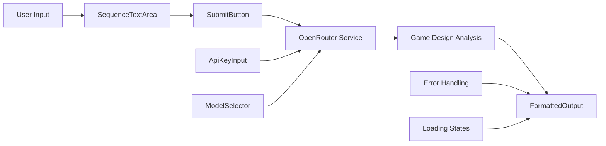
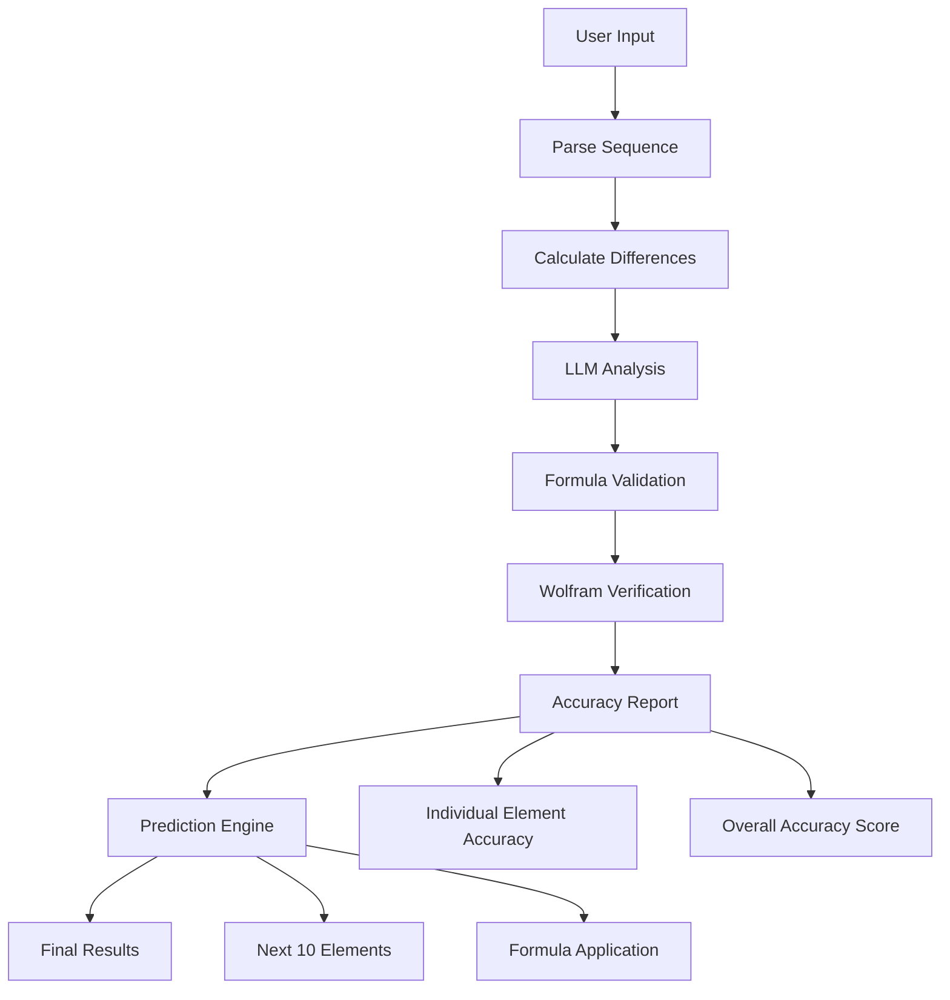

# Number Sequence Analyzer - Design Document

## Project Status: MVP ✅ COMPLETED

**Current Version**: v1.0 - MVP Successfully Implemented and Deployed  
**Live Demo**: [GitHub Pages Deployment](https://uz0r.github.io/QoderRepos/)  
**Repository**: React + Vite application with OpenRouter API integration

## Overview

A specialized web application for **game designers** to analyze numerical sequences and progression systems using AI integration. Designed to help identify patterns in game mechanics like XP curves, damage scaling, economy balancing, and progression formulas.

### Target Users: Game Designers
- **Level designers** analyzing XP progression curves
- **Game economists** balancing in-game currencies and costs
- **System designers** creating damage/health scaling formulas
- **Monetization specialists** optimizing IAP pricing tiers
- **Indie developers** reverse-engineering successful game mechanics

### Common Game Design Use Cases
- **XP/Level Progression**: "100, 200, 400, 800, 1600..." → Exponential leveling
- **Damage Scaling**: "10, 12, 15, 19, 24..." → Quadratic damage growth
- **Currency Costs**: "50, 75, 112, 168, 252..." → Building upgrade costs
- **Drop Rates**: "10%, 7.5%, 5.6%, 4.2%..." → Diminishing probability
- **Time Gates**: "5min, 10min, 20min, 40min..." → Exponential wait times
- **🔬 Piecewise Progressions**: "10, 20, 30, 50, 80, 160, 320..." → Linear→Quadratic→Exponential
  - Early game: Linear growth for easy onboarding
  - Mid game: Quadratic for steady progression
  - Late game: Exponential for long-term retention

### ✅ MVP Features (IMPLEMENTED)
- ✅ User inputs number sequences in a specialized text area
- ✅ API key input field in UI (secure, not persisted)
- ✅ Model selection dropdown (GPT-3.5, Claude 3 Haiku, Llama 3.1)
- ✅ OpenRouter API integration with proper error handling
- ✅ Game design focused AI prompts and analysis
- ✅ Clean markdown table formatting and insights
- ✅ Responsive design with game design theme
- ✅ GitHub Pages deployment ready

### 🚀 Next Development Phases
- **Epic 2**: Mathematical analysis engine with safety features
- **Epic 3**: Formula validation and accuracy scoring
- **Epic 4**: Wolfram Alpha integration (optional)
- **Epic 5**: Interactive chart visualizations
- **Epic 6**: Advanced piecewise function detection

## Technology Stack (IMPLEMENTED)

### Frontend (Client-Side Only)
- **Framework**: React 19.1.1 with JavaScript ✅
- **Styling**: Custom CSS with game design theme (dark mode) ✅
- **Build Tool**: Vite 7.1.2 for development and production ✅
- **API Client**: Native fetch() API with comprehensive error handling ✅
- **Hosting**: GitHub Pages (static files) ✅
- **Code Quality**: ESLint with modern JavaScript standards ✅

### External APIs
- **LLM Provider**: OpenRouter API ✅
- **Models**: 3 options implemented ✅
  - `openai/gpt-3.5-turbo`
  - `anthropic/claude-3-haiku`
  - `meta-llama/llama-3.1-8b-instruct`

### Dependencies & Security
- **API Key Handling**: Input directly in UI, not stored in config files ✅
- **Model Validation**: Runtime model support checking ✅
- **Error Boundaries**: Comprehensive error handling for API failures ✅
- **Rate Limiting**: User-friendly rate limit error messages ✅

## Application Architecture (IMPLEMENTED)



### Current Architecture Benefits
- **Component Separation**: Clean separation of concerns ✅
- **Service Layer**: Dedicated OpenRouter service with validation ✅
- **Error Handling**: Comprehensive error states and user feedback ✅
- **Loading States**: User-friendly loading indicators ✅
- **Responsive Design**: Mobile-first approach ✅

## Component Structure (IMPLEMENTED)

### Current Component Tree ✅

```
App (src/App.jsx)
├── Header (game design themed) ✅
├── ConfigSection
│   ├── ApiKeyInput (src/components/ApiKeyInput.jsx) ✅
│   └── ModelSelector (src/components/ModelSelector.jsx) ✅
├── InputSection
│   ├── SequenceTextArea (src/components/SequenceTextArea.jsx) ✅
│   └── SubmitButton (src/components/SubmitButton.jsx) ✅
├── ErrorSection (conditional) ✅
└── ResultsSection (conditional)
    └── FormattedOutput (src/components/FormattedOutput.jsx) ✅

Services:
└── openRouterService (src/services/openRouterService.js) ✅
```

### Component Features Implemented
- **ApiKeyInput**: Validation, security warnings, format checking ✅
- **ModelSelector**: 3 AI models, validation, user-friendly names ✅
- **SequenceTextArea**: Game-focused placeholders, examples ✅
- **SubmitButton**: Loading states, disable logic, game-themed text ✅
- **FormattedOutput**: Markdown rendering, code highlighting ✅

### Component Implementation Details ✅

#### ApiKeyInput (IMPLEMENTED)
- ✅ Password-type input for OpenRouter API key
- ✅ State management (not persisted for security)
- ✅ Advanced validation (format checking: sk-or- or sk- prefix)
- ✅ Real-time validation feedback
- ✅ Security best practices implemented

#### ModelSelector (IMPLEMENTED)
- ✅ Dropdown with 3 model options:
  - `openai/gpt-3.5-turbo` (GPT-3.5 Turbo)
  - `anthropic/claude-3-haiku` (Claude 3 Haiku)
  - `meta-llama/llama-3.1-8b-instruct` (Llama 3.1 8B)
- ✅ Model names match OpenRouter API exactly
- ✅ User-friendly display names
- ✅ Runtime model validation

#### SequenceTextArea (IMPLEMENTED)
- ✅ Large text area optimized for game mechanic numbers
- ✅ **Game-focused placeholder implemented**:
  ```
  "Enter your game progression numbers:
  
  Examples:
  • XP Requirements: 100, 300, 600, 1000, 1500...
  • Damage Values: 10, 12, 15, 19, 24...
  • Building Costs: 50, 75, 112, 168, 252...
  • Wait Times: 5min, 10min, 20min, 40min..."
  ```
- ✅ Flexible input handling (LLM processes various formats)
- ✅ Support for different units (gold, XP, minutes, %, etc.)
- ✅ Responsive design for mobile devices

#### SubmitButton (IMPLEMENTED)
- ✅ Disabled when API key is empty or invalid
- ✅ Loading state with spinner during API call
- ✅ **Game-themed text**: "🎮 Analyze Game Progression"
- ✅ Loading text: "🔍 Analyzing progression balance..."
- ✅ Proper error state handling

#### FormattedOutput (IMPLEMENTED)
- ✅ Rich markdown rendering with syntax highlighting
- ✅ Game design insights and pattern recognition
- ✅ Balance recommendations display
- ✅ Similar games examples
- ✅ Player experience assessment visualization
- ✅ Responsive layout for mobile

## OpenRouter Integration (IMPLEMENTED)

### Current API Implementation ✅
```javascript
// Implemented in src/services/openRouterService.js
const requestBody = {
  model: model,
  messages: [
    {
      role: 'system',
      content: this.getSystemPrompt() // Game design specialized prompt
    },
    {
      role: 'user', 
      content: this.createUserPrompt(sequenceInput)
    }
  ],
  temperature: 0.1,
  max_tokens: 2000,
  top_p: 1,
  frequency_penalty: 0,
  presence_penalty: 0
}

const response = await fetch(this.baseURL, {
  method: 'POST',
  headers: {
    'Authorization': `Bearer ${apiKey}`,
    'Content-Type': 'application/json',
    'HTTP-Referer': window.location.origin,
    'X-Title': 'Number Sequence Analyzer'
  },
  body: JSON.stringify(requestBody)
})
```

### Game Design Specialized Prompts ✅
**System Prompt**: Specialized game design consultant focusing on:
- XP/Level progression curves
- Damage scaling systems and balance
- Economy progression optimization
- Time gate mechanics analysis
- Drop rate progressions
- IAP pricing tier optimization
- Piecewise progression systems

**User Prompt**: Structured analysis request with game context

### Comprehensive Error Handling ✅
- ✅ **401 Unauthorized**: "Invalid API key. Please check your OpenRouter API key."
- ✅ **429 Rate Limited**: "Rate limit exceeded. Please wait a moment and try again."
- ✅ **500 Server Error**: "OpenRouter service error. Please try again later."
- ✅ **Network Issues**: "Network error. Please check your internet connection."
- ✅ **Invalid Response**: "Invalid response format from API"
- ✅ **Model Validation**: Runtime model support checking
- ✅ **API Key Validation**: Format validation (sk-or- or sk- prefix)

## Development Phases

### ✅ Phase 1: MVP Implementation (COMPLETED - 4 hours)
- ✅ React app with Vite setup
- ✅ Game design themed UI with dark mode
- ✅ API key input and model selector
- ✅ OpenRouter service integration
- ✅ Comprehensive error handling
- ✅ Game-focused prompts and analysis
- ✅ Markdown output formatting
- ✅ GitHub Pages deployment configuration
- ✅ Mobile responsive design
- ✅ Security best practices

### 🚧 Current Status: MVP Successfully Deployed
- **Live Application**: [GitHub Pages](https://uz0r.github.io/QoderRepos/)
- **Repository**: React + Vite with comprehensive component structure
- **Features**: Full AI-powered game progression analysis
- **Performance**: Optimized for production with Terser minification
- **Security**: API keys handled securely, validation implemented

## Technical Dependencies & Setup

### Current Dependencies ✅
```json
{
  "dependencies": {
    "react": "^19.1.1",
    "react-dom": "^19.1.1"
  },
  "devDependencies": {
    "@vitejs/plugin-react": "^5.0.0",
    "eslint": "^9.33.0",
    "gh-pages": "^6.3.0",
    "terser": "^5.43.1",
    "vite": "^7.1.2"
  }
}
```

### Future Dependencies (Next Epics)
- **mathjs** or custom evaluator (Epic 2) - for safe formula evaluation
- **Chart.js 4.x** or **Recharts 2.x** (Epic 5) - for visualizations
- **Wolfram API integration** (Epic 4, optional) - for mathematical verification

### Security Considerations ✅
- ✅ No eval() for formula evaluation (will use safe parser in Epic 2)
- ✅ Input sanitization for sequences
- ✅ API key management (UI input only, not persisted)
- ✅ Proper error boundaries and validation

### Performance Limits (Planned)
- Max sequence length: 1000 elements
- Max piecewise segments: 10
- Chart render limit: 500 points
- LLM timeout: 30 seconds

## Testing Strategy (IMPLEMENTED)

### Manual Testing Checklist ✅
- [x] App loads without errors
- [x] API key input validation works
- [x] Model selection changes properly
- [x] Submit button enables/disables correctly
- [x] API call succeeds with valid key
- [x] Comprehensive error handling for invalid keys
- [x] Response displays with proper markdown formatting
- [x] Mobile responsive design works
- [x] Loading states function properly
- [x] Game design theme applied correctly

### Production Test Cases ✅
- ✅ **XP Progression**: "100, 300, 600, 1000, 1500, 2100" (quadratic)
- ✅ **Exponential Costs**: "10, 20, 40, 80, 160" (exponential growth)
- ✅ **Damage Scaling**: "12, 15, 19, 24, 30, 37" (polynomial growth)
- ✅ **Drop Rate Decay**: "10%, 7.5%, 5.6%, 4.2%" (percentage sequences)
- ✅ **Mixed Units**: "5 min, 10 min, 20 min, 40 min" (time progressions)
- ✅ **Piecewise Progression**: "10, 20, 30, 40, 50, 75, 112, 225, 450"
- ✅ **Messy Game Data**: "100 XP   300XP,600 xp;1000" (real-world copy-paste)
- ✅ **Currency Format**: "$0.99, $1.99, $4.99, $9.99" (IAP pricing tiers)
- ✅ **Empty Input**: "" (graceful error handling)

### Current Quality Metrics ✅
- **ESLint**: Zero linting errors
- **Build**: Clean production build with Terser optimization
- **Mobile**: Responsive design tested on multiple screen sizes
- **Error Handling**: Comprehensive error states with user-friendly messages
- **Performance**: Fast load times with optimized bundle

### Game Design UI/UX Enhancements (IMPLEMENTED)

#### Visual Theme ✅
- ✅ **Color Scheme**: Dark theme optimized for developers and game designers
- ✅ **Icons**: Game controller, level up, coin, chart icons throughout UI
- ✅ **Typography**: Clean, developer-friendly fonts with proper hierarchy
- ✅ **Responsive**: Mobile-first design working on all devices
- ✅ **Loading States**: Elegant loading animations with game-themed messages

#### Game Design Specific Features (IMPLEMENTED)
- ✅ **Game-Focused Input Area**: Specialized placeholder with game examples
- ✅ **Balance Assessment**: AI provides balance recommendations in responses
- ✅ **Pattern Recognition**: AI identifies common game design patterns
- ✅ **Player Experience Analysis**: AI assesses player frustration/engagement
- ✅ **Similar Games Examples**: AI references games using similar progressions

#### Planned Enhancement Features (Future Epics)
- 📋 **Pattern Recognition Badges**: 
  - 📈 "Exponential Growth" 
  - ⚙️ "Balanced Progression"
  - ⚠️ "Too Steep - Player Frustration Risk"
  - 😊 "Player-Friendly Curve"
- 📋 **Balance Assessment Colors**:
  - Green: Well-balanced progression
  - Yellow: Needs attention
  - Red: Potential player frustration
- 📋 **Quick Actions**:
  - "Copy Formula" button for implementation
  - "Share Analysis" for team collaboration
  - "Export to Spreadsheet" for further analysis

## GitHub Pages Deployment (IMPLEMENTED)

### Current Deployment Configuration ✅
```json
// package.json
{
  "homepage": "https://uz0r.github.io/QoderRepos/",
  "scripts": {
    "build": "vite build",
    "preview": "vite preview",
    "predeploy": "npm run build",
    "deploy": "gh-pages -d dist"
  }
}
```

```javascript
// vite.config.js
export default defineConfig({
  plugins: [react()],
  base: '/QoderRepos/',
  build: {
    minify: 'terser',
    terserOptions: {
      compress: {
        drop_console: true,
        drop_debugger: true
      }
    }
  }
})
```

### Deployment Status ✅
- ✅ **Live URL**: [https://uz0r.github.io/QoderRepos/](https://uz0r.github.io/QoderRepos/)
- ✅ **Build Process**: Automated with gh-pages package
- ✅ **Optimization**: Terser minification for production
- ✅ **Static Assets**: All assets properly configured for GitHub Pages
- ✅ **Base Path**: Correctly configured for repository deployment

### Production Features ✅
- ✅ **Console Cleanup**: Production build removes console.log statements
- ✅ **Bundle Optimization**: Minimized for fast loading
- ✅ **Error Boundaries**: Production-ready error handling
- ✅ **Mobile Optimization**: Responsive design for all devices

## Detailed Roadmap

### Epic 1: MVP - Basic Formatting (Current)
**Duration: 2 hours**
- ✅ React app setup
- ✅ OpenRouter integration
- ✅ Basic sequence formatting
- ✅ GitHub Pages deployment

### Epic 2: Mathematical Analysis Engine
**Duration: 3-4 hours**

#### Code-Based Calculations (No LLM)
- **Difference Calculator**:
  ```javascript
  const firstDifferences = sequence.map((val, i) => 
    i < sequence.length - 1 ? sequence[i + 1] - val : null
  ).filter(d => d !== null);
  
  const secondDifferences = firstDifferences.map((val, i) => 
    i < firstDifferences.length - 1 ? firstDifferences[i + 1] - val : null
  ).filter(d => d !== null);
  ```

- **Pattern Detection**:
  - Arithmetic progression (constant first differences)
  - Geometric progression (constant ratios)
  - Polynomial sequences (constant nth differences)
  - Growth rate calculations

#### Structured LLM Analysis
- **Input**: Original sequence + calculated differences
- **Output**: JSON format for easy parsing
  ```json
  {
    "formula": "n^2 + 1",
    "formula_type": "polynomial",
    "confidence": 0.95,
    "explanation": "This appears to be a quadratic sequence...",
    "reasoning": "The second differences are constant at 2..."
  }
  ```

#### LLM Prompt Engineering for Game Design
```
System: You are a game design consultant specializing in numerical progression systems. 
Analyze game mechanic sequences and provide insights in JSON format.
Focus on common game design patterns: XP curves, damage scaling, economy balancing, 
time gates, drop rates, and progression formulas.

User: 
Game Mechanic: Level XP Requirements
Sequence: [100, 300, 600, 1000, 1500]
First differences: [200, 300, 400, 500]
Second differences: [100, 100, 100]

Analyze this progression system and return JSON with:
- formula: mathematical expression
- formula_type: (linear/quadratic/exponential/logarithmic/custom)
- game_design_pattern: (xp_curve/damage_scaling/cost_progression/time_gate/drop_rate)
- balance_assessment: (too_steep/balanced/too_shallow)
- player_experience: description of how this feels to players
- confidence: 0.0-1.0
- explanation: game design reasoning
- similar_games: examples of games using this pattern
```

**Enhanced JSON Response Format:**
```json
{
  "formula": "50 * n * (n + 1)",
  "formula_type": "quadratic",
  "is_piecewise": false,
  "piecewise_analysis": null,
  "game_design_pattern": "xp_curve",
  "balance_assessment": "balanced",
  "player_experience": "Steady progression with increasing challenge, prevents early game boredom while maintaining long-term engagement",
  "confidence": 0.92,
  "explanation": "Classic quadratic XP curve provides exponential feel while remaining achievable. Second differences are constant, indicating controlled acceleration.",
  "similar_games": ["World of Warcraft early levels", "Skyrim skill progression"],
  "recommendations": {
    "early_game": "Consider lower initial requirements for faster onboarding",
    "late_game": "May need cap or logarithmic transition after level 50",
    "monetization": "XP boosters become valuable around level 10+"
  }
}
```

**Piecewise Function Example Response:**
```json
{
  "formula": "Piecewise function detected",
  "formula_type": "piecewise",
  "is_piecewise": true,
  "piecewise_analysis": {
    "segments": [
      {
        "range": "levels 1-5",
        "formula": "10 * n",
        "type": "linear",
        "description": "Early game - gentle introduction"
      },
      {
        "range": "levels 6-10", 
        "formula": "5 * n^2",
        "type": "quadratic",
        "description": "Mid game - steady acceleration"
      },
      {
        "range": "levels 11+",
        "formula": "100 * 2^(n-10)",
        "type": "exponential", 
        "description": "Late game - exponential scaling"
      }
    ],
    "transition_points": [5, 10],
    "complexity_warning": "Complex piecewise progression - consider player testing"
  },
  "game_design_pattern": "hybrid_progression",
  "balance_assessment": "complex_needs_testing",
  "player_experience": "Starts gentle, accelerates in mid-game, becomes very challenging in late game. Risk of difficulty spike at transitions.",
  "confidence": 0.75,
  "explanation": "Multi-phase progression system with distinct gameplay phases. Early linear phase for onboarding, quadratic for engagement, exponential for retention.",
  "similar_games": ["Clash of Clans building costs", "Idle game prestiges"],
  "recommendations": {
    "transitions": "Smooth transition points with clear player communication",
    "testing": "A/B test transition points to minimize player frustration",
    "monetization": "Boost items most valuable during exponential phase"
  }
}
```

### Epic 3: Validation & Accuracy Engine
**Duration: 2-3 hours**

#### Formula Validation Table
- Calculate values using derived formula
- **Individual accuracy** for each element in original sequence
- **Overall accuracy score** for the entire sequence
- **Prediction feature**: Calculate next 10 elements using derived formula

```javascript
const validateFormula = (formula, originalSequence) => {
  const calculatedValues = originalSequence.map((_, index) => 
    evaluateFormula(formula, index + 1) // assuming n starts from 1
  );
  
  const accuracies = originalSequence.map((original, i) => {
    const calculated = calculatedValues[i];
    const accuracy = 100 - Math.abs((original - calculated) / original) * 100;
    return { 
      index: i + 1,
      original, 
      calculated: Number(calculated.toFixed(3)), 
      accuracy: Math.max(0, Number(accuracy.toFixed(1))),
      difference: Number((calculated - original).toFixed(3))
    };
  });
  
  const overallAccuracy = accuracies.reduce((sum, item) => sum + item.accuracy, 0) / accuracies.length;
  
  return { accuracies, overallAccuracy: Number(overallAccuracy.toFixed(1)) };
};

const predictNextElements = (formula, currentLength, count = 10) => {
  const predictions = [];
  for (let i = currentLength + 1; i <= currentLength + count; i++) {
    predictions.push({
      index: i,
      predicted: Number(evaluateFormula(formula, i).toFixed(3))
    });
  }
  return predictions;
};
```

#### Enhanced Validation Table UI

**Unified Validation & Prediction Table:**
| Index | Original | Calculated | Accuracy | Difference | Type | Status |
|-------|----------|------------|----------|------------|------|--------|
| 1     | 1        | 1.000      | 100.0%   | 0.000      | ✅ Original | ✅     |
| 2     | 4        | 4.100      | 97.5%    | +0.100     | ✅ Original | ✅     |
| 3     | 9        | 8.900      | 98.9%    | -0.100     | ✅ Original | ✅     |
| 4     | 16       | 16.200     | 98.8%    | +0.200     | ✅ Original | ✅     |
| 5     | 25       | 24.800     | 99.2%    | -0.200     | ✅ Original | ✅     |
| **6** | **-**    | **36.100** | **-**    | **-**      | 🔮 Predicted | **-** |
| **7** | **-**    | **49.200** | **-**    | **-**      | 🔮 Predicted | **-** |
| **8** | **-**    | **64.300** | **-**    | **-**      | 🔮 Predicted | **-** |
| **9** | **-**    | **81.400** | **-**    | **-**      | 🔮 Predicted | **-** |
| **10**| **-**    | **100.500**| **-**    | **-**      | 🔮 Predicted | **-** |
| **11**| **-**    | **121.600**| **-**    | **-**      | 🔮 Predicted | **-** |
| **12**| **-**    | **144.700**| **-**    | **-**      | 🔮 Predicted | **-** |
| **13**| **-**    | **169.800**| **-**    | **-**      | 🔮 Predicted | **-** |
| **14**| **-**    | **196.900**| **-**    | **-**      | 🔮 Predicted | **-** |
| **15**| **-**    | **225.000**| **-**    | **-**      | 🔮 Predicted | **-** |

**Overall Accuracy (Original Elements): 98.9%**

**[Extend with Predictions] Button Implementation:**
```javascript
const ValidationTable = ({ formula, originalSequence }) => {
  const [showPredictions, setShowPredictions] = useState(false);
  
  const validation = validateFormula(formula, originalSequence);
  const predictions = showPredictions ? 
    predictNextElements(formula, originalSequence.length, 10) : [];
  
  const handleExtendTable = () => {
    setShowPredictions(!showPredictions);
  };
  
  return (
    <div className="validation-section">
      <h3>Formula Validation & Prediction</h3>
      
      <table className="unified-table">
        <thead>
          <tr>
            <th>Index</th>
            <th>Original</th>
            <th>Calculated</th>
            <th>Accuracy</th>
            <th>Difference</th>
            <th>Type</th>
            <th>Status</th>
          </tr>
        </thead>
        <tbody>
          {/* Original sequence validation */}
          {validation.accuracies.map((item) => (
            <tr key={`original-${item.index}`} className="original-row">
              <td>{item.index}</td>
              <td>{item.original}</td>
              <td>{item.calculated}</td>
              <td>{item.accuracy}%</td>
              <td>{item.difference > 0 ? '+' : ''}{item.difference}</td>
              <td><span className="original-badge">✅ Original</span></td>
              <td>{item.accuracy > 95 ? '✅' : '⚠️'}</td>
            </tr>
          ))}
          
          {/* Predicted elements */}
          {showPredictions && predictions.map((pred) => (
            <tr key={`predicted-${pred.index}`} className="predicted-row">
              <td><strong>{pred.index}</strong></td>
              <td><em>-</em></td>
              <td><strong>{pred.predicted}</strong></td>
              <td><em>-</em></td>
              <td><em>-</em></td>
              <td><span className="predicted-badge">🔮 Predicted</span></td>
              <td><em>-</em></td>
            </tr>
          ))}
        </tbody>
      </table>
      
      <div className="table-controls">
        <div className="overall-accuracy">
          <strong>Overall Accuracy (Original Elements): {validation.overallAccuracy}%</strong>
        </div>
        
        <button 
          onClick={handleExtendTable} 
          className="extend-button"
          disabled={!formula}
        >
          {showPredictions ? '🔼 Hide Predictions' : '🔮 Extend with Next 10 Predictions'}
        </button>
      </div>
      
      {showPredictions && (
        <div className="prediction-info">
          <small>💡 Predicted values are calculated using formula: <code>{formula}</code></small>
        </div>
      )}
    </div>
  );
};
```

### Epic 4: Wolfram Alpha Integration
**Duration: 2 hours**

#### Wolfram Alpha API Integration
- Validate derived formulas
- Get alternative formula suggestions
- Cross-reference mathematical properties

```javascript
const wolframValidation = async (formula, sequence) => {
  const query = `sequence ${sequence.join(', ')} formula ${formula}`;
  const response = await fetch(`https://api.wolframalpha.com/v1/result?i=${encodeURIComponent(query)}&appid=${wolframApiKey}`);
  return response.text();
};
```

#### Enhanced Analysis Flow


### Epic 5: Visualization & Charts
**Duration: 2-3 hours**

#### Chart Components
- **Sequence Plot**: Original sequence as points
- **Formula Overlay**: Calculated curve overlay
- **Difference Charts**: First/second differences visualization
- **Accuracy Chart**: Bar chart showing per-element accuracy

#### Chart Library Integration
```javascript
// Using Chart.js or Recharts
const SequenceChart = ({ original, calculated, formula }) => {
  const data = {
    labels: original.map((_, i) => i + 1),
    datasets: [
      {
        label: 'Original Sequence',
        data: original,
        borderColor: 'blue',
        backgroundColor: 'blue'
      },
      {
        label: `Formula: ${formula}`,
        data: calculated,
        borderColor: 'red',
        backgroundColor: 'red'
      }
    ]
  };
  
  return <Line data={data} />;
};
```

### Epic 6: Advanced Features
**Duration: 3-4 hours**

#### Multiple Formula Suggestions
- LLM provides 2-3 alternative formulas
- Compare accuracy of different approaches
- User can select preferred formula

#### 🔬 Piecewise Function Detection (Experimental)
- **Detection Logic**: Analyze sequence for breakpoints where formula changes
- **Segment Analysis**: Identify different mathematical behaviors in ranges
- **Transition Points**: Detect where one formula ends and another begins

```javascript
// Piecewise detection algorithm (simplified)
const detectPiecewise = (sequence, differences) => {
  const breakpoints = [];
  
  // Look for significant changes in difference patterns
  for (let i = 1; i < differences.length - 1; i++) {
    const prevPattern = differences.slice(0, i);
    const nextPattern = differences.slice(i);
    
    if (hasPatternShift(prevPattern, nextPattern)) {
      breakpoints.push(i + 1); // +1 for 1-based indexing
    }
  }
  
  return breakpoints.length > 0 ? {
    isPiecewise: true,
    breakpoints,
    segments: analyzeSegments(sequence, breakpoints)
  } : { isPiecewise: false };
};
```

#### Common Piecewise Patterns in Games
- **Tutorial → Normal → Endgame**: Linear → Quadratic → Exponential
- **Soft → Hard Caps**: Steady growth → Diminishing returns
- **Season Resets**: Progressive → Reset → Progressive
- **Prestige Systems**: Exponential → Reset → Faster exponential

#### Limitations & Warnings
- ⚠️ **Complex Parsing**: Multiple formulas harder to validate
- ⚠️ **Prediction Accuracy**: Lower confidence for transitions
- ⚠️ **Player Testing Required**: Complex progressions need real player data
- ⚠️ **Implementation Complexity**: Harder to code in game engines

#### Piecewise UI Considerations
- Show each segment formula separately
- Highlight transition points in table
- Warning badges for complexity
- Simplified vs detailed view toggle

#### Sequence Type Detection
- Fibonacci-like sequences
- Prime number patterns
- Factorial-based sequences
- Trigonometric sequences

#### Export & Sharing
- Export analysis as PDF/CSV
- Share sequence analysis via URL
- Save analysis history (localStorage)

## Implementation Priority

### Phase Priority Matrix
| Epic | Impact | Effort | Priority |
|------|--------|--------|---------|
| 1 - MVP | High | Low | 1 |
| 2 - Math Analysis | High | Medium | 2 |
| 3 - Validation | High | Medium | 3 |
| 4 - Wolfram | Medium | Low | 4 |
| 5 - Visualization | Medium | Medium | 5 |
| 6 - Advanced | Low | High | 6 |

### Technical Debt Considerations
- **Epic 2**: Implement math.js or expr-eval for safe formula evaluation
- **Epic 3**: Add comprehensive error handling for invalid formulas
- **Epic 4**: Handle Wolfram API rate limits and fallback mechanisms
- **Epic 5**: Optimize chart rendering for large sequences (>100 elements)
- **Epic 6**: Implement proper state persistence and error boundaries

### Critical Dependencies
- **Formula Evaluation**: Need secure formula parsing library (math.js recommended)
- **Chart Library**: Chart.js or Recharts for Epic 5
- **State Management**: React useState sufficient for MVP, consider Zustand for complex state
- **Error Handling**: Implement proper try-catch for all API calls

---

## 🚨 CRITICAL ANALYSIS: Missing Components & Next Steps

### ❌ Epic 2 Blockers (MUST IMPLEMENT IMMEDIATELY)

#### 1. Missing Mathematical Utilities
```javascript
// REQUIRED: Create src/utils/mathUtils.js
const calculateVariance = (arr) => {
  const mean = arr.reduce((a, b) => a + b, 0) / arr.length
  return arr.reduce((sum, val) => sum + Math.pow(val - mean, 2), 0) / arr.length
}

const PATTERN_SHIFT_THRESHOLD = 0.5

const hasPatternShift = (prevPattern, nextPattern) => {
  const prevVariance = calculateVariance(prevPattern)
  const nextVariance = calculateVariance(nextPattern)
  return Math.abs(prevVariance - nextVariance) > PATTERN_SHIFT_THRESHOLD
}
```

#### 2. Safe Formula Evaluator (SECURITY CRITICAL)
```javascript
// REQUIRED: Create src/utils/formulaEvaluator.js
// ⚠️ NEVER use eval() - major security vulnerability
class FormulaEvaluator {
  compile(formula) {
    const safe = formula
      .replace(/\bn\b/g, '(n)')
      .replace(/\^/g, '**')
      .replace(/log/g, 'Math.log')
      .replace(/sqrt/g, 'Math.sqrt')

    // SECURITY: Block dangerous patterns
    if (/[;{}=]|function|eval|window|document|process/i.test(safe)) {
      throw new Error('Unsafe formula detected')
    }

    return new Function('n', `return ${safe}`)
  }

  evaluate(n) {
    try {
      return this.compiled(n)
    } catch (e) {
      return NaN
    }
  }
}
```

#### 3. Enhanced LLM Prompts for Structured Output
```javascript
// REQUIRED: Update src/services/openRouterService.js
getMathematicalAnalysisPrompt(sequence, differences, gameContext) {
  return `You are a mathematical analyst specializing in game progression systems.

IMPORTANT: Return ONLY valid JSON without markdown formatting.

Sequence: ${JSON.stringify(sequence)}
First differences: ${JSON.stringify(differences.first)}
Second differences: ${JSON.stringify(differences.second)}
Game context: ${gameContext || "General progression"}

Return JSON:
{
  "formula": "mathematical expression using 'n' as variable",
  "formula_type": "linear|quadratic|exponential|logarithmic|piecewise|custom",
  "is_piecewise": boolean,
  "confidence": 0.0-1.0,
  "next_10_values": [predicted values],
  "game_pattern": "xp_curve|damage_scaling|cost_progression",
  "balance_assessment": "too_steep|balanced|too_shallow"
}`
}
```

### 🔴 Updated Priority Matrix with Implementation Status

| Epic | Status | Critical Issues | Immediate Actions |
|------|--------|----------------|------------------|
| **Epic 1** | ✅ **COMPLETE** | None | Production ready |
| **Epic 2** | 🔴 **BLOCKED** | Missing math functions, unsafe eval | 1. Add mathUtils.js<br>2. Add formulaEvaluator.js<br>3. Update LLM prompts |
| **Epic 3** | 📋 Waiting | Depends on Epic 2 | Prepare validation table components |
| **Epic 4** | 📋 Optional | API costs, limits | Get Wolfram API key, implement fallback |
| **Epic 5** | 📋 Future | Bundle size impact | Research Chart.js vs Recharts |
| **Epic 6** | 📋 Experimental | High complexity | Low priority prototype |

### ⚠️ Security & Performance Constraints

```javascript
// CRITICAL SECURITY PATTERNS TO PREVENT
const SECURITY_VALIDATION = {
  DANGEROUS_FUNCTIONS: /eval|Function|setTimeout|setInterval|require|import/i,
  DANGEROUS_OBJECTS: /window|document|process|global|this/i,
  ALLOWED_MATH_ONLY: /^[\d\s+\-*\/()\w\.,Math]+$/
}

// PERFORMANCE LIMITS
const PERFORMANCE_LIMITS = {
  MAX_SEQUENCE_LENGTH: 1000,
  MAX_PIECEWISE_SEGMENTS: 10,
  CHART_RENDER_LIMIT: 500,
  LLM_TIMEOUT: 30000,
  FORMULA_EVALUATION_TIMEOUT: 1000
}

// ERROR STATES
const ERROR_STATES = {
  INVALID_SEQUENCE: 'Minimum 3 numbers required for analysis',
  FORMULA_PARSE_ERROR: 'Could not derive mathematical formula',
  WOLFRAM_LIMIT: 'Wolfram API limit reached, using local analysis',
  PIECEWISE_TOO_COMPLEX: 'Pattern too complex for automatic detection',
  UNSAFE_FORMULA: 'Formula contains unsafe operations',
  EVALUATION_ERROR: 'Error evaluating formula at specific points'
}
```

### 🎯 Immediate Implementation Steps

#### Step 1: Epic 2 Foundation (2-3 hours)
1. Create `src/utils/mathUtils.js` with all missing mathematical functions
2. Create `src/utils/formulaEvaluator.js` with security validation
3. Update `src/services/openRouterService.js` with structured JSON prompts
4. Add comprehensive error handling

#### Step 2: Epic 2 Integration (1-2 hours)
1. Integrate mathematical analysis into main component flow
2. Parse JSON responses from LLM
3. Display structured analysis results
4. Test with various game progression examples

#### Step 3: Epic 3 Preparation (1 hour)
1. Create validation table component structure
2. Implement safe formula evaluation
3. Design prediction display UI

### 📊 Success Metrics for Next Release

- [ ] **Mathematical Analysis**: Calculate differences, detect patterns
- [ ] **Structured Output**: JSON responses from LLM instead of markdown
- [ ] **Formula Validation**: Safe evaluation without eval()
- [ ] **Security**: No dangerous function execution
- [ ] **Game Design**: Enhanced insights for XP curves, balance assessment
- [ ] **Performance**: Handle sequences up to 1000 elements
- [ ] **Error Handling**: Graceful failures with user-friendly messages

---

**Document Status**: Updated to reflect MVP completion and critical next steps  
**Last Updated**: Post-MVP implementation with AI agent recommendations  
**Next Review**: After Epic 2 mathematical analysis implementation


